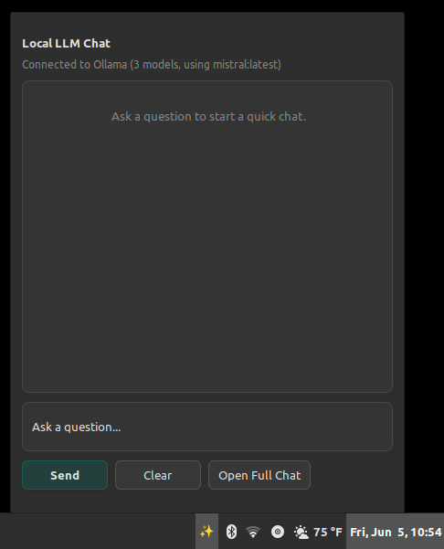
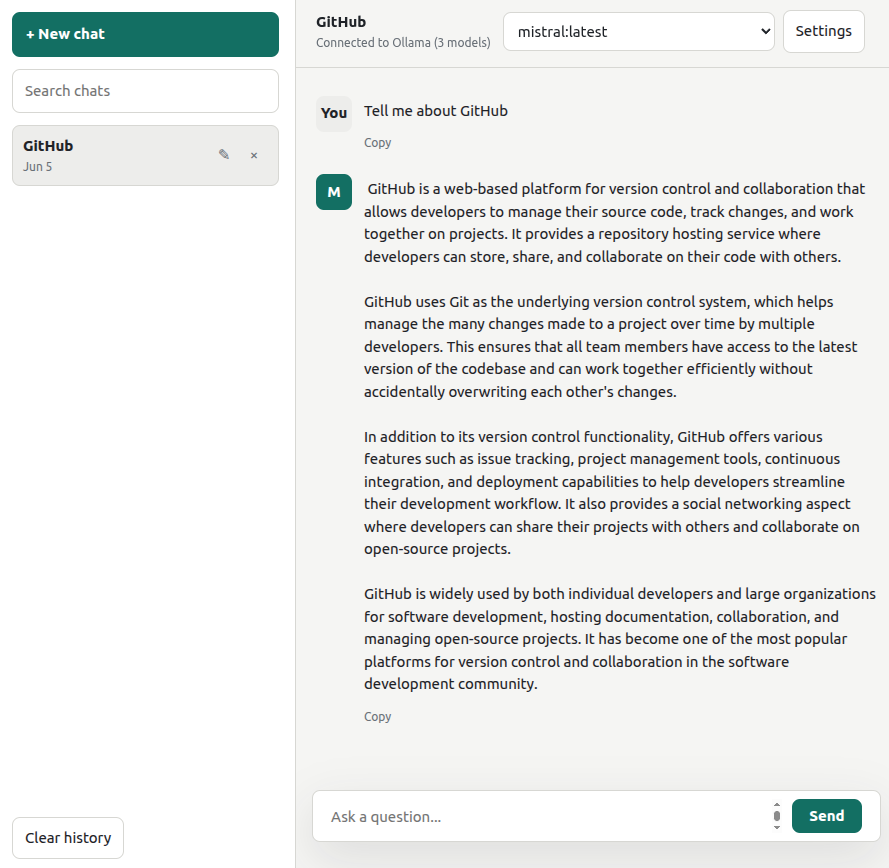

# Linux Mint Local LLM Applet

A small, dependency-free chat interface for an Ollama models.

The project includes:

- A browser chat UI served by `python3 app.py`
- A local Python proxy for Ollama's chat API
- An optional Linux Mint Cinnamon panel applet that opens a quick chat popup
- A user `systemd` service installer for autostarting the local chat server

## Screenshots

### Cinnamon applet popup



### Full browser UI



## Requirements

- Linux with Python 3.10 or newer
- Ollama installed and running
- The `mistral` model pulled into Ollama
- Linux Mint Cinnamon 6.x if you want the panel applet

No Python packages or Node packages are required.

## Get the Code

Clone or download this repository, then enter the project directory:

```bash
git clone <repo-url>
cd llm-interface
```

## Install Ollama and Mistral

Install Ollama on Linux:

```bash
curl -fsSL https://ollama.com/install.sh | sh
```

Start Ollama:

```bash
ollama serve
```

If Ollama was installed as a system service, start it with:

```bash
sudo systemctl start ollama
```

Pull and test Mistral:

```bash
ollama pull mistral
ollama run mistral
```

Type `/bye` to exit the Ollama terminal chat.

Useful checks:

```bash
ollama -v
ollama list
curl http://127.0.0.1:11434/api/tags
```

Official references:

- Ollama Linux install: <https://docs.ollama.com/linux>
- Mistral model page: <https://ollama.com/library/mistral>

## Run the Browser UI

From this repo:

```bash
python3 app.py
```

Open:

```text
http://127.0.0.1:3000
```

The browser UI stores chat history and per-chat settings in browser local storage.

## Configuration

The server defaults to:

- Ollama URL: `http://127.0.0.1:11434`
- Model: `mistral`
- UI port: `3000`

Override them with environment variables:

```bash
OLLAMA_BASE_URL=http://127.0.0.1:11434 OLLAMA_MODEL=mistral PORT=3000 python3 app.py
```

## Install the Linux Mint Cinnamon Applet

The Cinnamon applet installs as `local-mistral-chat@local` and displays a `✨` panel icon. It opens a compact native popup for quick questions. The full browser UI remains available for saved chat history.

Run:

```bash
bash scripts/install-cinnamon-applet.sh
```

The installer:

- Copies the applet to `~/.local/share/cinnamon/applets/local-mistral-chat@local`
- Creates `~/.config/systemd/user/llm-interface.service`
- Enables and starts the user service
- Keeps the service tied to the current repo path

Then add the applet from Cinnamon:

1. Right-click the panel.
2. Open **Applets**.
3. Find **Local Mistral Chat**.
4. Add it to the panel.

If Cinnamon already has the applet listed but it does not appear, restart Cinnamon or log out and back in.

### Configure the Applet Model

The applet detects installed Ollama models from the local server and shows them in a model dropdown inside the popup. Select a model there to use it for future applet messages.

The same model list is also available in the applet's Cinnamon preferences:

- Local chat server URL, default `http://127.0.0.1:3000`
- Ollama model, default `mistral`

To change the applet model:

1. Right-click the `✨` panel applet.
2. Open **Configure**.
3. Set **Ollama model** to any detected model already available in Ollama.

Install another model with:

```bash
ollama pull llama3.2
```

The full browser UI has its own model selector. The applet preference only controls the Cinnamon popup.

### Continue a Popup Chat in the Browser

Click **Open Full Chat** to transfer the popup's current conversation into a new saved browser chat. The browser opens with the transferred chat selected, preserving its messages and model so you can continue the conversation with the full web interface.

The transfer is held briefly by the local server and is only available on the local machine. Opening the full chat with an empty popup continues to open the browser normally.

## Service Commands

Check the local chat service:

```bash
systemctl --user status llm-interface.service
```

Restart it:

```bash
systemctl --user restart llm-interface.service
```

View logs:

```bash
journalctl --user -u llm-interface.service -f
```

Disable autostart:

```bash
systemctl --user disable --now llm-interface.service
```

## Troubleshooting

Check that Ollama is running:

```bash
curl http://127.0.0.1:11434/api/tags
```

Check that this app's server is running:

```bash
curl http://127.0.0.1:3000/api/config
```

Check Cinnamon applet logs:

```bash
tail -n 120 ~/.xsession-errors
```

Search only for this applet:

```bash
grep -Ei "local-mistral-chat|lookingglass|error" ~/.xsession-errors
```

If port `3000` is already in use, either stop the other process or run this app with another port:

```bash
PORT=3001 python3 app.py
```

If you change the port for the service, update both:

- `systemd/llm-interface.service`
- `cinnamon/local-mistral-chat@local/applet.js`

Then rerun:

```bash
bash scripts/install-cinnamon-applet.sh
```

## Uninstall the Cinnamon Applet

Remove the applet from the panel in Cinnamon's Applets settings, then run:

```bash
systemctl --user disable --now llm-interface.service
rm -f ~/.config/systemd/user/llm-interface.service
rm -rf ~/.local/share/cinnamon/applets/local-mistral-chat@local
systemctl --user daemon-reload
```

## Notes

- The browser UI persists chat history in browser local storage.
- The Cinnamon applet is a quick-chat surface and does not share browser history.
- The app binds to `127.0.0.1` only.
